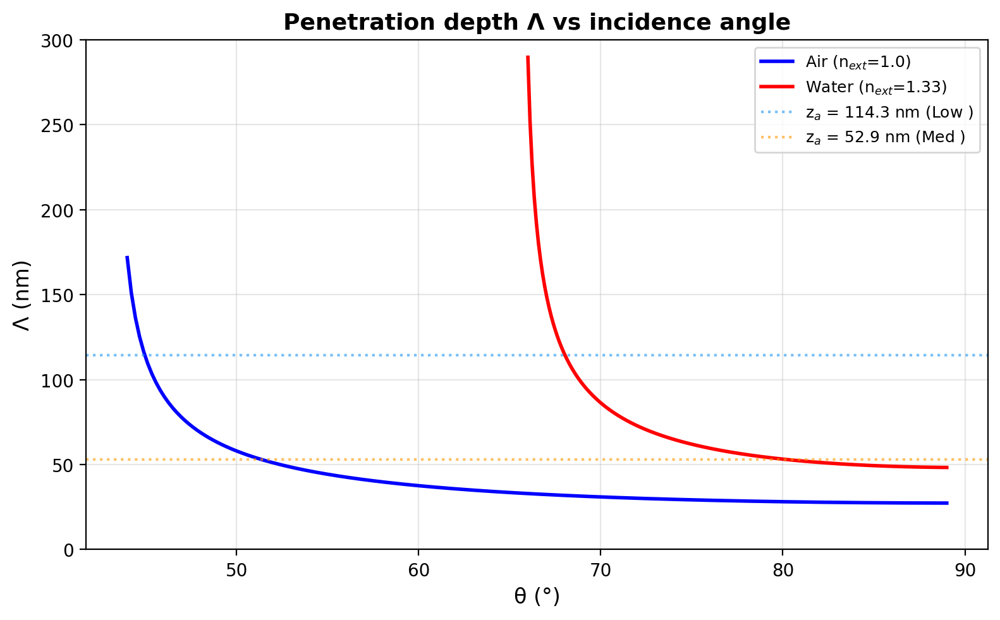
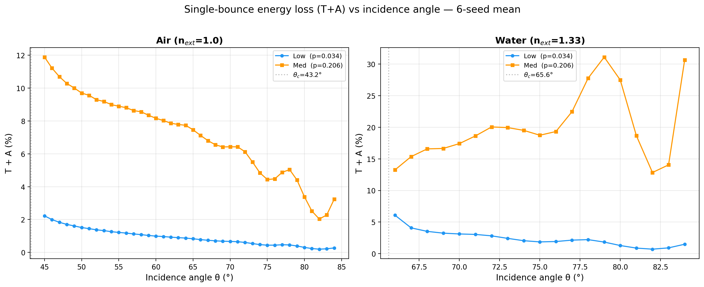
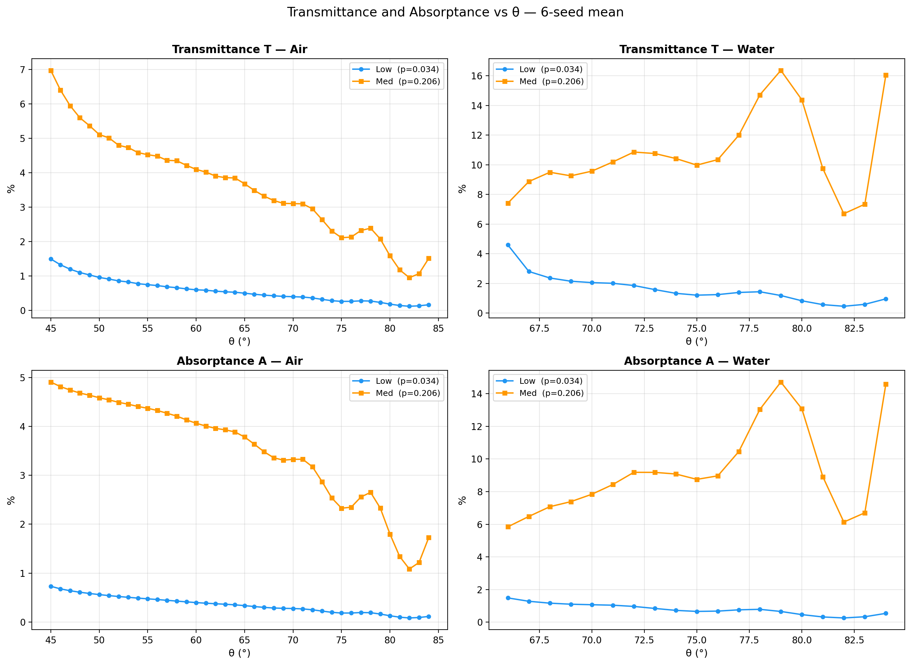
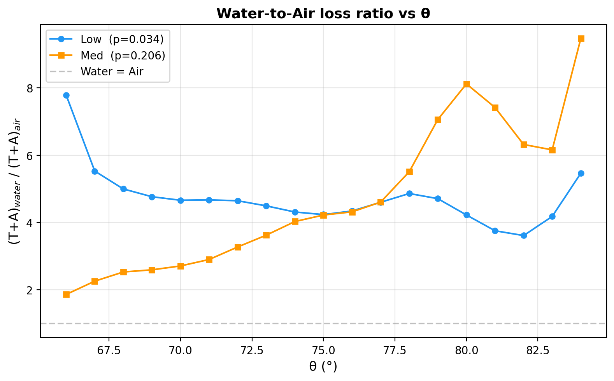
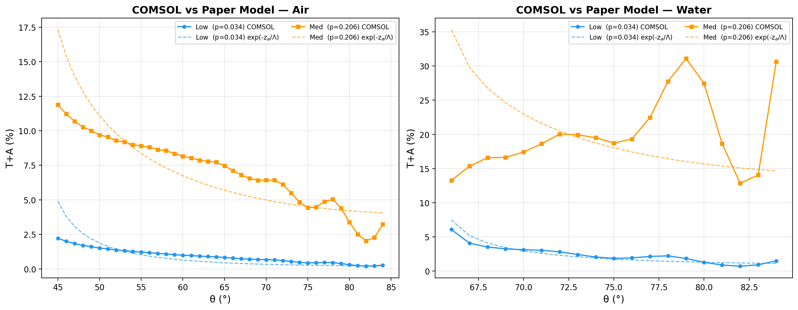

# COMSOL 倏逝波仿真总结

## 参考文献

Song et al., "Evanescent waves modulate energy efficiency of photocatalysis within TiO₂ coated optical fibers illuminated using LEDs", *Nature Communications* **12**, 4101 (2021).
DOI: [10.1038/s41467-021-24370-8](https://doi.org/10.1038/s41467-021-24370-8)

## 物理模型

采用 COMSOL 电磁波频域模块（`ewfd`），2D TE 偏振，散射场公式。模拟石英光纤表面 TiO₂ 纳米粒子涂层与倏逝波的相互作用。

### 光路与场分布详解

#### 基本光路

模拟的是一束**无限宽的 TE 平面波**从石英内部以入射角 θ 打到石英/外部介质界面上。当 θ > θ_c（临界角）时，发生全内反射（TIR），界面下方产生倏逝波。

```
                      PML（吸收边界，防止假反射）
  ──────────────────────────────────────────────────

         ↗ 反射平面波                 石英 (n=1.46)
        /   方向：向右上
       /    与入射波对称
      / θ
     /                                 入射波+反射波在石英中
    /                                  叠加形成驻波（y方向）
   ↙ 入射平面波
      方向：向右下
      入射角 θ（从法线量）
  ━━━━━━━●━━━●━━━●━━━━━━━━━━━━━━━━━  界面 y=0，TiO₂ 粒子
       ○    ○   ○                      倏逝波（指数衰减）
  ~~~~~~~~                              + 粒子散射光
                                       外部介质（空气/水）
  ──────────────────────────────────────────────────
                      PML（吸收边界）
```

本质上就是**一束光打界面一次**。之所以看起来复杂，是因为：

1. **左右是 Floquet 周期边界**：等效于无限宽的平面波（不是有限宽光束），所以看不到光束的"边缘"
2. **显示的是总场 |E|**：入射波、反射波、倏逝波、粒子散射波全部叠加在一起
3. **散射场公式**：COMSOL 先解析计算无粒子时的背景场（TIR 解），再求解粒子引起的散射场，最后叠加

#### 场分布图各区域的含义

以实际输出的 |E| 场分布图为例，从上到下各区域对应如下：

```
 ┌──────────────────────────────────────────────┐
 │ ░░ 逐渐变暗                                  │  PML 吸收层：
 │ ░░░                                          │  人工吸收出射波，
 │                                              │  场强逐渐衰减到零
 ├──────────────────────────────────────────────┤
 │ ━━━━━━━━ 亮 ━━━━━━━━━━━━━━━━━━━━━━━━━━━━━━ │
 │ ─────── 暗 ──────────────────────────────── │  石英层：
 │ ━━━━━━━━ 亮 ━━━━━━━━━━━━━━━━━━━━━━━━━━━━━━ │  入射波 + 反射波
 │ ─────── 暗 ──────────────────────────────── │  在 y 方向形成驻波
 │ ━━━━━━━━ 最亮 ━━━━━━━━━━━━━━━━━━━━━━━━━━━━ │  → 水平亮暗条纹
 ├──●──●──●──●──●──●──●──●──●──●───────────────┤  界面 y=0
 │ ████████ 不规则散射花样 █████████████████████ │  外部介质：
 │ ████   （由粒子散射产生）██████████████████   │  倏逝波快速衰减
 │ ██                                           │  + 粒子散射的近场
 │ ░                                            │  （花样不规则）
 ├──────────────────────────────────────────────┤
 │ ░░░ 全暗                                     │  PML 吸收层
 └──────────────────────────────────────────────┘
```

#### 石英区水平条纹的来源

石英中的总电场是入射波和反射波的叠加：

```
E_total(x, y) = E₀ exp[-i(kₓx - k_y·y)]        ← 入射波（向右下）
              + r_s · E₀ exp[-i(kₓx + k_y·y)]    ← 反射波（向右上）
```

其中 kₓ = n_q·k₀·sinθ（x 方向波矢），k_y = n_q·k₀·cosθ（y 方向波矢）。

两列波在 y 方向相向传播，形成**驻波**。场强 |E| 在 y 方向周期性振荡：
- **亮条纹**：入射波和反射波相长干涉（振幅相加）
- **暗条纹**：相消干涉（振幅相减）
- x 方向是行波（exp[-ikₓx]），但 |E| 图只显示幅值，看不出 x 方向的传播

条纹间距 = λ / (2·n_q·cosθ)：
- θ = 60° 时：365 / (2 × 1.46 × 0.5) ≈ **250 nm**
- θ = 75° 时：365 / (2 × 1.46 × 0.259) ≈ **483 nm**（条纹更稀疏）

#### 界面附近的倏逝波

界面以下（y < 0），场以指数衰减：

```
|E(y)|² ∝ |t_s|² · exp(-2|y|/Λ)
```

其中 |t_s|² 是 Fresnel 透射系数（TIR 条件下为复数，但模给出界面处的场强），Λ 是穿透深度。

- **无粒子时**：倏逝波不传输能量（只是近场储能），所有光 100% 反射
- **有粒子时**：TiO₂ 粒子"扰动"倏逝场，将近场能量部分转化为：
  - **吸收（A）**：粒子的虚部折射率吸收光能转化为热
  - **散射（T）**：散射光变成传播波进入外部介质
  - 两者之和从反射光中"扣除" → R = 1 − T − A < 100%

#### 外部介质区的散射花样

界面下方看到的不规则图案来自**粒子的散射近场**。每个纳米粒子相当于一个亚波长散射体，在其周围产生强烈的局部场增强和干涉。密集粒子之间还有多重散射。这些散射花样的特征：

- 在粒子密集处（High case）花样最复杂
- 在粒子稀疏处（Low case）只在个别粒子附近有扰动
- 远离界面处迅速衰减为暗背景

### 物理参数（固定）

| 参数 | 值 |
|---|---|
| 波长 λ | 365 nm（UV LED） |
| 石英折射率 n_q | 1.46 |
| TiO₂ 折射率 n_T | 2.5 − 0.018i（有吸收） |
| TiO₂ 粒子半径 r | 10.5 nm（P25 锐钛矿/金红石） |

### 可变参数（运行时输入）

| 参数 | 说明 |
|---|---|
| 入射角 θ | 需 > 临界角以保证全内反射 |
| 外部介质折射率 n_ext | 空气 1.0 / 水 1.33 |

临界角：θ_c = arcsin(n_ext / n_q)
- 空气：θ_c = 43.2°
- 水：θ_c = 65.6°

### 计算域

```
y (nm)
 1200 ┌─────────────────────────┐
      │       PML (400 nm)      │  完美匹配层（吸收边界）
  800 ├─────────────────────────┤
      │                         │
      │    石英层 (800 nm)       │  ← TE 平面波入射
      │                         │     + 全内反射波
    0 ├──●──●─────●──●──●──●────┤  界面 (y=0)
      │  ○    ○                 │  TiO₂ 纳米粒子
      │       ○      ○    ○    │
      │                         │
 -600 ├─────────────────────────┤
      │       PML (400 nm)      │  完美匹配层（吸收边界）
-1000 └─────────────────────────┘
      0                      10000
                x (nm)
```

- 宽度：10 μm，左右为 Floquet 周期边界
- 背景场：解析全内反射解（石英内入射波 + Fresnel 反射波，外部介质中倏逝波）
- 网格：全局 hmax=35 nm（≈λ/8n），TiO₂ 粒子区域 hmax=3 nm

## 三种涂层构型（来自文献 Table 1 & Supplementary）

| 构型 | 覆盖率 p | 平均间距 z_a (nm) | 接触粒子数 | 悬浮粒子数 | 物理机制 |
|---|---|---|---|---|---|
| **Low**  | 0.034 (3.4%) | 114.3 | ~16  | ~24  | 倏逝波主导 |
| **Med**  | 0.206 (20.6%) | 52.9  | ~98  | ~147 | 过渡区 |
| **High** | 0.528 (52.8%) | 7.7   | ~251 | ~377 | 折射/吸收主导 |

- **覆盖率 p (patchiness)**：光纤表面与 TiO₂ 直接接触的面积比
- **平均间距 z_a**：光纤表面与 TiO₂ 涂层之间的平均距离

### 粒子生成算法

随机生成两类粒子（随机种子 seed=42）：

1. **接触粒子**（圆心在界面 y=0）：数量 = `round(p × W / 2r)`，随机撒 x 坐标，不重叠约束（间距 > 2.5r）。控制覆盖率 p。
2. **悬浮粒子**（圆心在 y < 0）：数量 ≈ 接触粒子的 1.5 倍。间距 gap 从指数分布 `Exp(z_a)` 采样，圆心 `y = -(r + gap)`。控制平均间距 z_a。

## 测量方法

- **透射功率 P_trans**：在外部介质中的水平切线（y = −580 nm，PML 上方）积分 Poynting 矢量 y 分量 `ewfd.Poavy`
- **吸收功率 P_abs**：在 TiO₂ 域上积分电阻热密度 `ewfd.Qh`
- **入射功率 P_inc**：TE 平面波解析公式 S_y = k_y / (2ωμ₀)，P_inc = W × S_y
- **反射率 R = 1 − T − A**（能量守恒）

---

## 角度扫描仿真结果（seed=13，1° 分辨率）

对空气（θ = 45°~84°，1° 间隔，40 个角度）和水（θ = 66°~84°，1° 间隔，19 个角度）进行完整扫描。每个角度跑 Low/Med/High 三种构型，共 **177 组仿真**（seed=13）。

原始数据：`results_seed13.csv`（177 行）。分析脚本：`analyze_results.py`。

### 穿透深度 Λ

$$\Lambda = \frac{\lambda}{4\pi} \left( n_q^2 \sin^2\theta - n_{ext}^2 \right)^{-1/2}$$

穿透深度 Λ 随角度的变化见下图。水中 Λ 在临界角附近发散（θ_c = 65.6°），远大于空气中的 Λ（θ_c = 43.2°）。三条水平虚线标记了三种构型的平均粒子间距 z_a。



关键交叉点：
- **Low**（z_a = 114.3 nm）：空气中 Λ 始终 < z_a；水中仅在 θ < 68° 附近 Λ ≈ z_a
- **Med**（z_a = 52.9 nm）：空气中 θ ≈ 51° 处 Λ = z_a；水中 θ ≈ 83° 处 Λ = z_a
- **High**（z_a = 7.7 nm）：Λ 始终 ≫ z_a，倏逝场完全覆盖紧贴界面的粒子

### 总损耗 T+A vs 角度



**空气（左图）**：
- **High**（红）：T+A 从 ~6% 随 θ 上升至 ~24%，在 80°–81° 达到峰值，之后回落。整体吸收主导（A/T ≈ 10:1）
- **Med**（橙）：T+A 从 ~13% 平缓下降至 ~2%，透射和吸收贡献相当（A/T ≈ 0.8:1）
- **Low**（蓝）：T+A 从 ~2.5% 单调下降至 ~0.2%，始终很小

**水（右图）**：
- **Med** 成为损耗最大的构型（峰值 31% @ 79°），在 77°–84° 区间有剧烈波动
- **High** 损耗反而很低（3.8%–6.7%），因为水中折射率对比度降低
- **Low** 保持在 1%–6%，在临界角附近最高后单调下降

### T 和 A 分别展示



关键发现：
- **High 构型以吸收为主**：A/T ≈ 10（空气）和 8（水），因为密集粒子层像一层"吸收膜"，散射透射极少
- **Med 和 Low 以透射为主**：T > A（A/T < 1），稀疏粒子主要起散射作用而非吸收
- **水中 Med 的透射率 T** 在 78°–84° 出现剧烈波动（最高 17%），这是穿透深度与粒子间距匹配引起的共振效应

### 水/空气损耗比



在可比角度范围（66°–84°）内计算每个角度的 (T+A)_water / (T+A)_air：

- **Low**（蓝）：始终 > 1，平均 **4.7×**，因为水中 Λ 增大使更多远离界面的粒子参与吸收
- **Med**（橙）：从 ~2× 上升至 ~8×，在大角度处水中优势更明显，因为 Λ_water ≈ z_a 实现最优匹配
- **High**（红）：始终 < 1，稳定在 **0.25–0.4×**，因为水的折射率降低了界面处的倏逝场强度

这三条曲线的分离非常干净，说明水/空气比的排序 **Low > Med > 1 > High** 在所有角度都成立。

### 与论文解析模型 exp(−z_a/Λ) 的对比



将论文 Eq.(2) 的简化模型 E_E,dis ∝ exp(−z_a/Λ) 按均值归一化后与 COMSOL 结果对比：

- **Low & Med**：COMSOL 曲线形状与 exp(−z_a/Λ) 吻合很好，说明倏逝波衰减是主导机制
- **High**：COMSOL 在空气中随 θ 增大而增大，但 exp(−z_a/Λ) 预测的变化极弱（因为 z_a/Λ ≈ 0.2–0.3，指数函数几乎平坦）。COMSOL 看到的强角度依赖来自**多重散射和近场干涉**，这超出了单粒子指数衰减模型

---

## 对比分析汇总

### 1. 角度平均：总损耗排序

对所有角度的 T+A 取简单平均，得到单次 TIR bounce 的平均损耗（seed=13）：

- **空气 (45°–84°)**：High 12.8% > Med 7.6% > Low 1.0% → **与文献排序一致**
- **水 (66°–84°)**：Med 20.1% > High 5.4% > Low 2.6% → **Med 反超 High**

### 2. 与文献实验 E_dis 的对比

文献 Fig. 3a 中 E_dis（6.5 cm 光纤累积耗散能量）：
- 排序：High > Med > Low（空气和水都是）
- 水/空气比：High ~1.05×, Med ~1.16×, Low ~2.00×

我们的单次 bounce 结果（θ = 66°–84° 平均）：
- 水/空气比：Low **4.7×**, Med **3.9×**, High **0.32×**

**定性一致的方面**：
- 空气中排序 High > Med > Low（完全一致）
- Low 水/空气比 > 1（方向一致）
- Med 在水中利用倏逝波效率最高（与文献 Mode 3 分析一致）

**定性偏差及原因**：

1. **单次 bounce vs 多次累积**：文献 E_dis 是沿 6.5 cm 光纤多次 TIR bounce 的累积。High 每次损耗大（~13%），经 ~10 次 bounce 后光能基本耗尽，无论空气还是水都饱和 → 比值趋近 1。单次 bounce 看不到这个饱和效应。

2. **角度范围不完整**：文献模型覆盖 θ ∈ [0.376π, 0.495π] = [67.7°, 89.1°]，我们只到 84°。85°–89° 处 Λ 极小（~27 nm），对 High（z_a = 7.7 nm）有利。

3. **折射光（Mode 1/2）未充分捕捉**：文献 Fig. 4d 显示 High 涂层有 42% 能量通过折射光耗散。我们的散射场公式以 TIR 解为背景场，主要捕捉 Mode 3（倏逝波），Mode 1/2 的贡献可能被低估。

### 3. seed 依赖性

seed=13 vs 之前的 seed=42（3° 间隔，63 组）对比：
- 整体趋势完全一致：排序、水/空气比方向不变
- High 构型的波动细节不同（如峰值角度位移 2°–3°），确认大角度波动是特定粒子构型的干涉效应
- Low 和 Med 曲线非常光滑，对 seed 不敏感

---

## 下一步计划

### 优先级 1：多 seed 统计平均

当前只有 seed=13 的 1° 数据。已计划跑 seed=1, 7, 29, 53（见 `run_seeds.txt`），每个 seed 177 组，共 5×177 = 885 组仿真。

目标：
- 对每个 (θ, n_ext, case) 取 5 个 seed 的 T/A/R 平均值和标准差
- 消除 High 构型的粒子构型依赖波动，得到更可靠的角度曲线
- 误差棒表征随机粒子构型的不确定度

### 优先级 2：多 bounce 传播模型

将单次 bounce 的 T(θ), A(θ) 代入几何光学多 bounce 累积模型：

$$E_{dis}(L) = E_0 \sum_{\theta} \left[ 1 - (1 - T(\theta) - A(\theta))^{N_{bounce}(\theta, L)} \right]$$

其中 N_bounce = L / (d·tan θ)，d 为光纤直径，L 为涂层长度。

这能将单次 bounce 结果直接与文献 Fig. 5c 的累积耗散曲线对比。

### 优先级 3：补充高角度数据（85°–89°）

空气中 85°–89° 范围 Λ = 27–28 nm，接近 High 的 z_a = 7.7 nm。补充这些角度可能使 High 在水中的排名上升，更接近文献的 High > Med > Low 排序。

### 优先级 4：Fresnel 折射光修正

在 High 涂层（p = 0.528）中，界面处有大面积 quartz/TiO₂ 直接接触。这部分光通过折射（而非倏逝波）进入 TiO₂ 并被吸收。可在解析层面补充 Fresnel 折射透射计算：

$$E_{R,dis}' = E_0 \cdot \frac{pT\{1 - [(1-p)(1-e^{-z_a/\Lambda}) + p(1-T)]^{L/(d\tan\theta)}\}}{(1-p)e^{-z_a/\Lambda} + pT}$$

---

## 文件结构

```
comsol_evanes/
├── evanescent_sim.py              主仿真脚本
├── nc_start.pdf                   参考文献
├── EVANESCENT_SIM_SUMMARY.md      本文件
├── collect_results.py             汇总 result/ 中的 txt → CSV
├── analyze_results.py             读取 CSV 生成折线图 + 统计分析
├── results_seed13.csv             seed=13 的 177 条汇总数据
├── run_seeds.txt                  多 seed 批量运行命令
├── figures/                       分析图（analyze_results.py 生成）
│   ├── fig1_TA_vs_theta.png         T+A vs θ（空气 + 水）
│   ├── fig2_T_A_separate.png        T 和 A 分别展示（2×2）
│   ├── fig3_water_air_ratio.png     水/空气损耗比 vs θ
│   ├── fig4_comsol_vs_model.png     COMSOL vs 论文解析模型
│   └── fig5_penetration_depth.png   穿透深度 Λ vs θ
├── result/                        原始 energy_balance txt 文件
│   ├── energy_balance_p_0.034_za_114.3_45_1_s13.txt
│   ├── ...                          （共 177 个文件）
│   └── energy_balance_p_0.528_za_7.7_84_1.33_s13.txt
├── p_0.034_za_114.3_75_1.33/     子文件夹（含场分布图和 COMSOL 模型）
│   ├── field_p_0.034_za_114.3_75_1.33.png
│   ├── field_data_p_0.034_za_114.3_75_1.33.txt
│   ├── particles_p_0.034_za_114.3_75_1.33.json
│   └── evanescent_p_0.034_za_114.3_75_1.33.mph
├── p_0.206_za_52.9_75_1.33/
│   └── ...
└── p_0.528_za_7.7_75_1.33/
    └── ...
```

## 运行方法

```bash
# 单次仿真
python evanescent_sim.py <theta_deg> <n_ext> <case>
python evanescent_sim.py 75 1.33 low                 # 水，75°，low
python evanescent_sim.py --seed 13 60 1.0 all         # seed=13，空气，60°，全部

# 汇总数据
python collect_results.py                              # 读取 result/ → results.csv

# 分析 + 画图
python analyze_results.py                              # 读取 CSV → figures/
```

依赖：COMSOL Multiphysics（含波动光学模块）、Python 包 `mph`、`jpype`、`numpy`、`matplotlib`。
