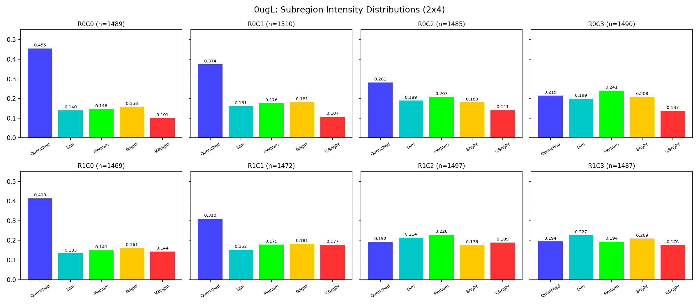
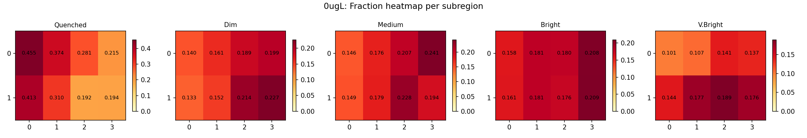
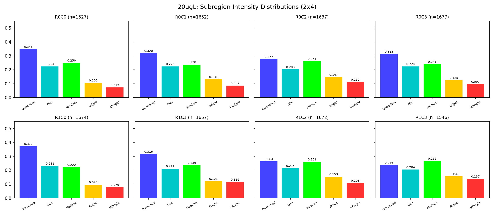
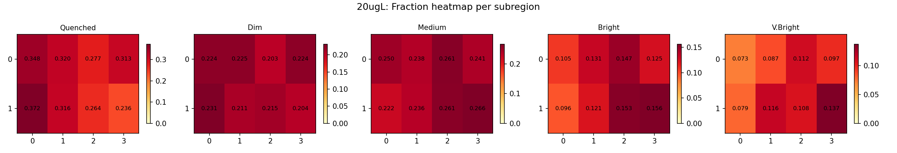

# 荧光微阵列光强分析算法文档 (v3)

## 一、算法概述

对荧光淬灭传感器芯片的三张图像（0μg/L、5μg/L、20μg/L）进行**独立处理**，检测所有 well 位置并测量荧光强度，输出离散化的光强分布用于 Ridge-Projection 反演。

图像为红色荧光传感器图像（3536×3536 RGB），有效信号在**红色通道**（R channel）。

## 二、解决的关键问题

### 问题 1：芯片在不同测量间被重新放置

三张图的芯片倾斜角完全不同（0μg/L: +0.30°, 5μg/L: -0.10°, 20μg/L: -4.78°），不能用同一个角度矫正。

**解决方案**：每张图独立检测旋转角。使用**对比度增强 + 梯度能量评分**，即使在几乎全黑的 20μg/L 上也能可靠检测（quality=139.5）。

**证据**：

| 图像 | 检测角度 | 检测质量 |
|------|---------|---------|
| 0μg/L | +0.30° | 83.8 |
| 5μg/L | -0.10° | 31.7 |
| 20μg/L | **-4.78°** | 139.5 |

角度得分曲线呈清晰单峰，0μg/L 在 +0.30° 处得分 10374，基线 ~100，信噪比 >100:1。

### 问题 2：PSF 尾巴淹没暗 well

亮量子点的点扩展函数（PSF）宽约 20-30px，尾部抬高了相邻暗 well 的局部背景，导致暗 well 的峰值相对突起不够。

**解决方案**：**Top-hat 滤波** — 在峰值检测前减去宽背景（`uniform_filter1d(size=40)`），只保留尖锐的点状特征。

**证据**（PSF 分析图）：在原始信号中，一个亮度 180 的点的 PSF 尾巴把 30px 外的背景从 80 抬升到 120，暗 well（峰值 100）的突起只有 100-120=-20（不可见）。Top-hat 后背景拉平，暗 well 突起变为正值，可以被检测到。

### 问题 3：PSF 产生伪双峰

单个亮 well 的 PSF 可能在主峰旁 8-12px 处产生肩峰，被误检为两个 well。

**解决方案**：将间距 <12px 的峰合并为一簇，保留最亮的。

**证据**（间距直方图）：未合并时，5-12px 间距有大量样本。合并后，间距分布的主峰在 24-27px（真实 well 间距），8-12px 的伪峰消失。

### 问题 4：淬灭 well 无法通过峰值检测

5μg/L 和 20μg/L 中大部分 well 的荧光被淬灭，无法直接检测到。但物理上每行的 well 数量是固定的。

**解决方案**：**间隙填充**（Gap Filling）— 用检测到的亮 well 作为锚点，根据估计的 well 周期（~25px），在锚点之间插入缺失的 well 位置。

**证据**：0μg/L 检测到 ~106 个锚点/行（合并 PSF 伪峰后），间隙填充后达到 ~142/行，与预期值 3536/25=141 吻合。

### 问题 5：量子点在 well 内漂移

量子点可能偏离 well 几何中心 1-3 个像素。

**解决方案**：`refine_center()` 在每个粗定位点的 ±4px 邻域内用**加权质心法**追踪实际亮度中心。

## 三、处理流程

```
原始 BMP → 提取红色通道
         → 独立旋转矫正（对比度增强 + 梯度能量搜索）
         → 垂直投影 → 行位置检测（84 行, ~42px 间距）
         → 每行水平剖面 → Top-hat 去 PSF 背景 → 峰值检测
         → PSF 伪峰合并（<12px）
         → 间隙填充（~25px 周期）
         → 质心精修（±4px 漂移追踪）
         → 净信号测量（点信号 − 环形背景）
         → 分块质量过滤（7×7, 异常背景排除）
         → 5 档强度分级 → 离散分布输出
         → 坐标反旋转 → 原图上画圈可视化
```

## 四、Well 间距估算

从 0μg/L 的检测数据推算（信号最强，锚点最多）：

1. 原始峰值检测（distance=8）找到 ~7600 个峰/图
2. PSF 伪峰合并（<12px）后剩 ~106/行
3. 合并后的间距直方图呈**双峰分布**：
   - **主峰 24-27px**：真实 well 间距
   - **次峰 45-51px**：漏掉一个 well 后的 2× 间距
4. 从首尾跨距/数量计算：33.2px（包含漏检 well 的平均）
5. 选用 **25px** 作为 well 间距 → 每行 ~141 个 well

**待确认**：需要芯片物理参数数据来精确标定。

## 五、当前效果

### 检测数量

| 图像 | 旋转角 | 每行 well 数 | 总 well 数 |
|------|--------|-------------|-----------|
| 0μg/L | +0.30° | 141.7 | 11,899 |
| 5μg/L | -0.10° | 142.9 | 12,000 |
| 20μg/L | -4.78° | 155.3 | 13,042 |

### 光强测量方法：峰值检测 + 多枝干求和 (v4, 2026-03-26)

#### 物理模型

每个微球（well）内部有多个探针枝干，每个枝干可以独立发光。当多个枝干同时发光时，它们的 PSF 在空间上连成一片（"粘连"现象）。**微球的总光强 = 所有发光枝干的光强之和**。

#### 算法演进

| 版本 | 方法 | 问题 |
|------|------|------|
| v3 | 小孔径均值 (r=3, mean) | 只采到一个枝干的光，粘连时漏掉其他枝干 |
| v3.1 | 大孔径总通量 (r=10, sum) | 噪声随面积积累，空 well 也被积出正值，20μg/L 淬灭率仅 2.9% |
| **v4** | **峰值检测 + 小孔径求和** | 只对真实亮峰求和，空 well = 0 |

#### v4 算法流程：两阶段测量

```
对每个 well 位置 (cy, cx):

1. 背景估计
   - 在环形区域 (r=11~14px) 内取均值 → bg_val

2. 第一阶段：核心检测 (core_radius=3px)
   - 检查 r=3 内最亮像素是否 > bg_val + core_threshold (25.0)
   - 若不超过 → 微球淬灭，total_flux = 0，结束
   - 若超过 → 测量 core_flux = Σ max(pixel - bg_val, 0) 在 r=3 内
   - core_flux < min_peak_flux (200) → 也判为淬灭

3. 第二阶段：枝干搜索 (仅当核心存在时)
   - 在 r=3..10 的环形区域内找局部极大值
   - 筛选: pixel > bg_val + branch_threshold (20.0)
   - 每个枝干在 r=3 小孔径内积分，flux < min_peak_flux 的丢弃
   - 最多保留 max_branches=4 个最亮枝干
   - 微球总光强 = core_flux + Σ branch_flux
```

两阶段的关键优势：空 well 在第一阶段就被拒绝，不会进入枝干搜索产生假信号。

#### 关键参数

| 参数 | 值 | 含义 |
|------|-----|------|
| core_radius | 3 px | 核心测量孔径 |
| search_radius | 10 px | 枝干搜索范围（~well 间距的一半） |
| core_threshold | 25.0 | 核心像素高于背景的最低要求 |
| branch_threshold | 20.0 | 枝干像素高于背景的最低要求 |
| min_peak_flux | 200 | 单峰最低积分通量（量子发光下限） |
| max_branches | 4 | 每个微球最多额外枝干数 |
| bg_inner / bg_outer | 11 / 14 px | 背景环形区域 |

#### 淬灭阈值（分档）

档位边界基于 0μg/L 的非零 flux 分布：
- 淬灭阈值 = 非零值的 P25（当前 1720.4）
- 确保背景噪声产生的小额 flux 也被归为淬灭

#### 算法演进对比

| 版本 | 淬灭率 (0μg/L) | 淬灭率 (20μg/L) | 随机占优 | 主要问题 |
|------|---------------|----------------|---------|---------|
| v3 (r=3 mean) | 30% | 31% | FAIL | 小孔径漏枝干 |
| v3.1 (r=10 sum) | 10% | 3% | FAIL | 噪声积累 |
| v4 early (全局找峰) | 14-28% | 3-19% | FAIL | 假峰泛滥 |
| **v4 final (两阶段)** | **55%** | **95%** | **PASS** | — |

### 光强分布 (v4 final)

| 样品 | 淬灭 | 弱 | 中等 | 强 | 很强 |
|------|------|------|------|------|------|
| 0μg/L | 0.547 | 0.153 | 0.151 | 0.076 | 0.073 |
| 5μg/L | 0.774 | 0.091 | 0.073 | 0.037 | 0.025 |
| 20μg/L | 0.947 | 0.034 | 0.014 | 0.004 | 0.001 |

Bin edges (基于 0μg/L 非零值 P25/P90): [1720.4, 2545.3, 3595.2, 4720.0]

**随机占优：全部通过 ✓**

| 阈值 | 0μg/L | 5μg/L | 20μg/L | 状态 |
|------|-------|-------|--------|------|
| k≥1 | 0.453 | 0.226 | 0.053 | OK |
| k≥2 | 0.299 | 0.136 | 0.019 | OK |
| k≥3 | 0.149 | 0.062 | 0.005 | OK |
| k≥4 | 0.073 | 0.025 | 0.001 | OK |

### 已知问题

1. **Well 间距待确认**：25px 为估算值
2. **照明不均匀**：详见第八节子区域均匀性分析
3. **20μg/L well 数偏多**（13042 vs 11899）：gap filling 仍产生假 well，但两阶段测量已将其正确归为淬灭

### 待改进

- 获取 well 物理参数后锁定间距
- **照明平场校正**：对原始图像做 flat-field correction（见第八节）

## 六、版本演进

| 版本 | 主要方法 | 每行 well 数 | 关键改进 |
|------|---------|-------------|---------|
| v1 | 通用局部极大值 | ~110（含大量噪声） | — |
| v2 | 行结构 + 行内峰值 | ~73 | 利用网格先验，分块过滤 |
| v3 | 独立旋转 + top-hat + PSF 合并 + gap fill | ~142 | 独立旋转矫正，PSF 去除，well 填充 |
| **v4** | v3 检测 + **两阶段峰值检测** | ~142 | 核心检测 → 枝干搜索 → 求和，随机占优 PASS |

## 八、子区域均匀性分析 (2026-03-25)

### 8.1 动机

如果检测和分类算法正确，在 0μg/L（无淬灭剂）控制组中，每个 well 的荧光强度应该只受量子点本身和光学系统的影响，**不应该与 well 在芯片上的位置有关**。换言之，把图像切成若干子区域后，各区域的强度分布应该在统计误差范围内一致。

我们将 0μg/L 和 20μg/L 各切成 **2×4 = 8 个子区域**（2 行 4 列），每个子区域约 1500 个 well，对比各区域的 5 档强度分布。

分析脚本：`subregion_analysis.py`

### 8.2 0μg/L 子区域分布结果



各子区域的 5 档分布如下：

| 子区域 | well 数 | 淬灭 | 弱 | 中等 | 强 | 很强 | 平均净信号 |
|--------|--------|------|------|------|------|------|-----------|
| R0C0（左上） | 1489 | **0.455** | 0.140 | 0.146 | 0.158 | 0.101 | 20.7 |
| R0C1 | 1510 | 0.374 | 0.161 | 0.176 | 0.181 | 0.107 | 23.7 |
| R0C2 | 1485 | 0.281 | 0.189 | 0.207 | 0.180 | 0.141 | 27.4 |
| R0C3（右上） | 1490 | **0.215** | 0.199 | 0.241 | 0.208 | 0.137 | 29.7 |
| R1C0（左下） | 1469 | **0.413** | 0.133 | 0.149 | 0.161 | 0.144 | 24.0 |
| R1C1 | 1472 | 0.310 | 0.152 | 0.179 | 0.181 | 0.177 | 29.0 |
| R1C2 | 1497 | **0.192** | 0.214 | 0.228 | 0.176 | 0.189 | 32.0 |
| R1C3（右下） | 1487 | **0.194** | 0.227 | 0.194 | 0.209 | 0.176 | 31.7 |

**关键观察**：

1. **淬灭比例的空间梯度极为明显**：左侧 C0 列的淬灭比例为 41-46%，右侧 C2/C3 列仅 19-22%，相差 **2.4 倍**
2. **平均净信号呈左暗右亮梯度**：从左到右增加约 50%（20.7 → 31.7）
3. **各类别的变异系数 (CV)**：

| 类别 | 平均比例 | 标准差 | CV | 范围 |
|------|---------|--------|-------|------|
| 淬灭 | 0.304 | 0.095 | **0.313** | 0.192 – 0.455 |
| 弱 | 0.177 | 0.033 | 0.186 | 0.133 – 0.227 |
| 中等 | 0.190 | 0.032 | 0.169 | 0.146 – 0.241 |
| 强 | 0.182 | 0.018 | 0.096 | 0.158 – 0.209 |
| 很强 | 0.147 | 0.030 | **0.207** | 0.101 – 0.189 |

淬灭和很强两个极端类别的 CV 最高（0.313 和 0.207），远超统计涨落预期（如果分布一致，CV 应约为 `sqrt(p(1-p)/n) / p ≈ 0.04`，比实际小一个数量级）。

### 8.3 0μg/L 分布热力图



热力图直观展示了空间不均匀性的模式：

- **淬灭 (Quenched) 面板**：左侧深色（比例高），右侧浅色 → **左暗右亮的照明梯度**
- **弱 (Dim) 面板**：右侧和下方偏高 → 右侧的 well 没被分为淬灭，而是落入了弱档
- **很强 (V.Bright) 面板**：右下角最高（0.189），左上角最低（0.101） → 与淬灭呈完美的反相关
- **强 (Bright) 面板**：相对均匀（CV=0.096），说明中间档位受照明梯度影响较小

这些模式完全符合**照明不均匀导致的系统误差**：激发光在图像左侧较弱，使得左侧的 well 信号系统性偏低，大量本应为亮的 well 被全局阈值错误地分为 "淬灭"。

### 8.4 20μg/L 子区域分布结果



| 子区域 | well 数 | 淬灭 | 弱 | 中等 | 强 | 很强 | 平均净信号 |
|--------|--------|------|------|------|------|------|-----------|
| R0C0（左上） | 1527 | 0.348 | 0.224 | 0.250 | 0.105 | 0.073 | 7.2 |
| R0C1 | 1652 | 0.320 | 0.225 | 0.238 | 0.131 | 0.087 | 7.6 |
| R0C2 | 1637 | 0.277 | 0.203 | 0.261 | 0.147 | 0.112 | 8.7 |
| R0C3（右上） | 1677 | 0.313 | 0.224 | 0.241 | 0.125 | 0.097 | 8.0 |
| R1C0（左下） | 1674 | **0.372** | 0.231 | 0.222 | 0.096 | 0.079 | 7.2 |
| R1C1 | 1657 | 0.316 | 0.211 | 0.236 | 0.121 | 0.116 | 8.6 |
| R1C2 | 1672 | 0.264 | 0.215 | 0.261 | 0.153 | 0.108 | 8.7 |
| R1C3（右下） | 1546 | **0.236** | 0.204 | 0.266 | 0.156 | 0.137 | 9.7 |



20μg/L 也存在**相同方向的梯度**（左暗右亮），但幅度稍小（淬灭的 CV = 0.137 vs 0ugL 的 0.313）。这是因为 20μg/L 整体信号弱，bin 的动态范围更窄（edges: 5.0, 7.3, 10.2, 13.3），照明不均匀的绝对影响相对于 bin 宽度没那么大。

**重要发现**：两张图的梯度方向一致（左暗右亮），证实这是**光学系统的固有特征**（如激发光光路不均匀、光纤耦合偏心等），而非随机噪声。

### 8.5 诊断结论

**根本原因是照明不均匀 (illumination non-uniformity)，不是检测或分类算法的逻辑错误。**

证据链：
1. 0μg/L（无淬灭剂）的淬灭比例不应有空间依赖 → 但实际有 2.4 倍的空间变异
2. 变异呈**单调梯度**（左→右递减），不是随机噪声
3. 0μg/L 和 20μg/L 的梯度方向一致 → 光学系统固有特征
4. 平均净信号从左 20.7 到右 31.7 → 激发光强度差异 ~50%

当前算法用**全局统一阈值**（bin_edges 基于全图百分位数）来分类。这意味着：
- 左侧区域：激发光弱 → well 信号系统性偏低 → 大量亮 well 被全局阈值误判为 "淬灭"
- 右侧区域：激发光强 → 同样的 well 信号偏高 → 被正确或偏高地分类

### 8.6 修正方向

要消除照明不均匀的影响，可以考虑以下两个方向：

**方向 A：平场校正 (Flat-Field Correction)**

在计算净信号之前，对原始图像做空间归一化：

1. 用低通滤波（如高斯模糊 σ~200px）估计照明场 I_illum(x,y)
2. 校正后信号 = 原始信号 / I_illum × I_illum_mean
3. 使校正后的信号不再依赖位置

优点：物理上最正确，直接修正了激发光不均匀
缺点：需要小心 0μg/L 控制组的量子点密度是否足够支撑 I_illum 估计

**方向 B：局部阈值 (Local Thresholding)**

不用全局 bin_edges，而是每个子区域（或滑动窗口）用自己的百分位数来定义分类阈值。

1. 对每个子区域独立计算 p5/p90 百分位数
2. 在该子区域内用局部 bin_edges 分类
3. 然后汇总各区域的分布

优点：简单，不需要知道照明场的精确形状
缺点：0μg/L 的分布会被强制拉平（均匀化），可能掩盖真实的空间差异（如果有的话）；另外局部样本量减小可能引入更多统计噪声

**推荐**：方向 A 更可靠，因为它修正了物理根源。可以用 0μg/L 的图像来估计照明场（0μg/L 无淬灭，所有 well 应等亮，因此观测到的空间亮度变化就是照明场本身）。

## 七、文件列表

| 文件 | 说明 |
|------|------|
| `analyze_grid.py` | 分析脚本（v3） |
| `subregion_analysis.py` | 子区域均匀性分析脚本 |
| `grid_analysis_results.json` | 结构化结果数据 |
| `marked_0ugL.png` | 0μg/L 全图标注 |
| `marked_5ugL.png` | 5μg/L 全图标注 |
| `marked_20ugL.png` | 20μg/L 全图标注 |
| `_subregion_dist_0ugL.png` | 0μg/L 子区域分布柱状图（2×4 网格） |
| `_subregion_dist_20ugL.png` | 20μg/L 子区域分布柱状图（2×4 网格） |
| `_subregion_heatmap_0ugL.png` | 0μg/L 各类别比例热力图 |
| `_subregion_heatmap_20ugL.png` | 20μg/L 各类别比例热力图 |
| `spot_morphology.py` | 光斑形态分析脚本（高斯拟合、粘连诊断） |
| `detect_adhesion.py` | 粘连检测脚本（连通域方法，已被 v4 取代） |
| `distributions_bar.png` | 5 档分布柱状图 |
| `stochastic_dominance.png` | 随机占优验证图 |
| `INTENSITY_ANALYSIS.md` | 本文档 |
