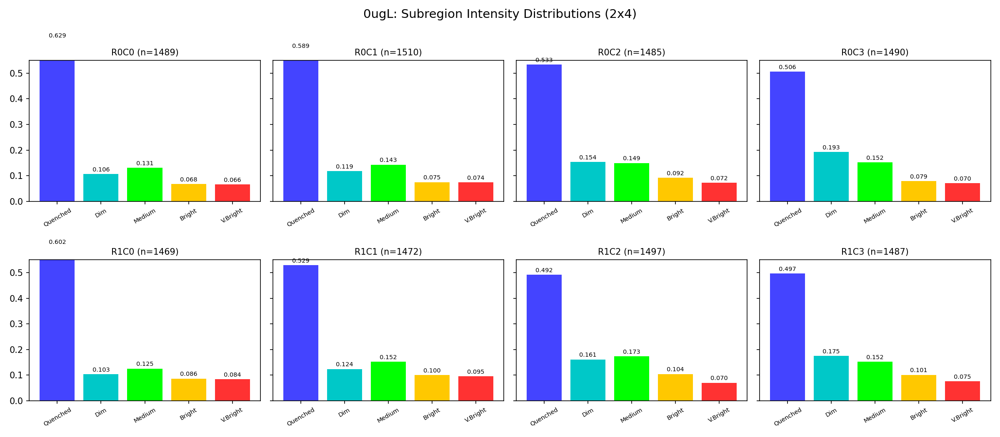
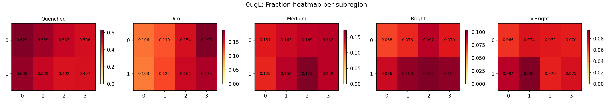
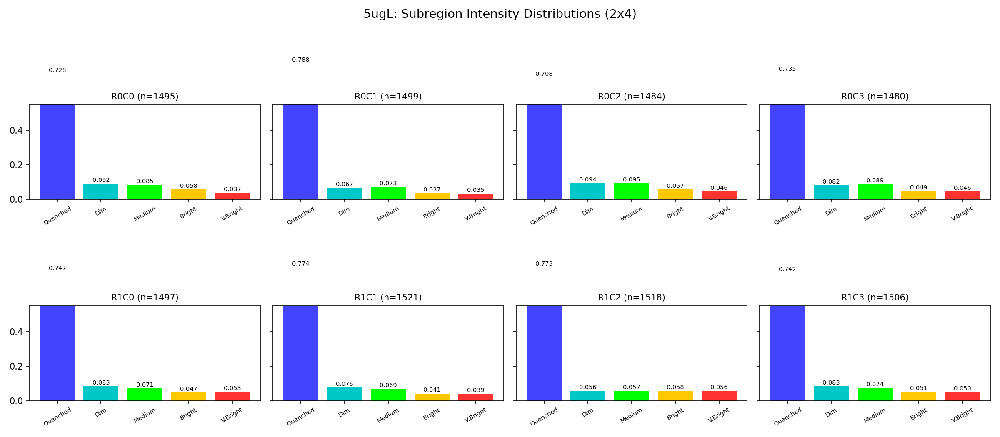
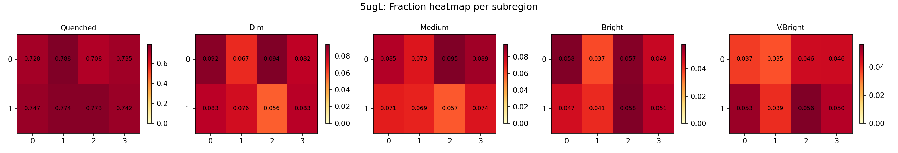
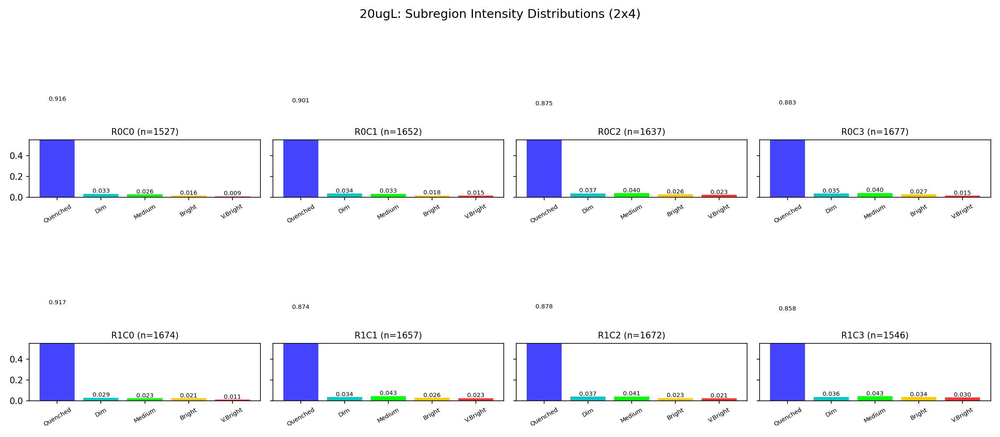
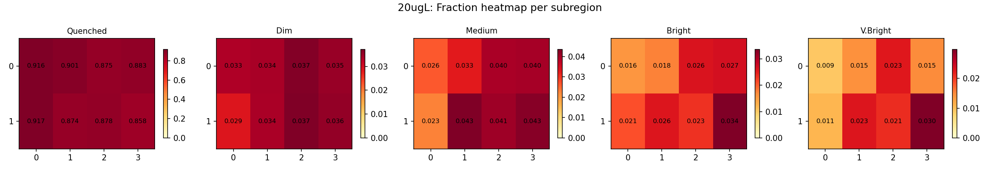

# 荧光微阵列光强分析算法文档 (v4)

## 一、算法概述

对荧光淬灭传感器芯片的三张图像（0μg/L、5μg/L、20μg/L）进行**独立处理**，检测所有 well 位置并测量荧光强度，输出离散化的光强分布用于 Ridge-Projection 反演。

图像为红色荧光传感器图像（3536×3536 RGB），有效信号在**红色通道**（R channel）。三张图来自**三个独立芯片**（不同物理位置，不能做跨图网格映射）。

## 二、解决的关键问题

### 问题 1：芯片在不同测量间被重新放置

三张图的芯片倾斜角完全不同（0μg/L: +0.30°, 5μg/L: -0.10°, 20μg/L: -4.78°），不能用同一个角度矫正。

**解决方案**：每张图独立检测旋转角。使用**对比度增强 + 梯度能量评分**。

| 图像 | 检测角度 |
|------|---------|
| 0μg/L | +0.30° |
| 5μg/L | -0.10° |
| 20μg/L | -4.78° |

### 问题 2：PSF 尾巴淹没暗 well

**解决方案**：**Top-hat 滤波** — 减去宽背景（`uniform_filter1d(size=40)`），只保留尖锐点状特征。

### 问题 3：PSF 产生伪双峰

**解决方案**：将间距 <12px 的峰合并为一簇，保留最亮的。

### 问题 4：淬灭 well 无法通过峰值检测

**解决方案**：**间隙填充**（Gap Filling）— 用检测到的亮 well 作为锚点，按 ~25px 周期插入缺失 well。

### 问题 5：量子点在 well 内漂移

**解决方案**：`refine_center()` 在 ±4px 邻域内用加权质心法追踪实际亮度中心。

### 问题 6：多枝干粘连 (v4 新增)

每个微球有多个探针枝干，当多枝干同时发光时，PSF 在空间上连成一片。

**解决方案**：**两阶段峰值检测** — 先检测核心峰，再搜索周围枝干，对所有峰的通量去重叠求和。详见第五节。

## 三、处理流程

```
原始 BMP → 提取红色通道
         → 独立旋转矫正（对比度增强 + 梯度能量搜索）
         → 垂直投影 → 行位置检测（84 行, ~42px 间距）
         → 每行水平剖面 → Top-hat 去 PSF 背景 → 峰值检测
         → PSF 伪峰合并（<12px）
         → 间隙填充（~25px 周期）
         → 质心精修（±4px 漂移追踪）
         → 两阶段光强测量（核心检测 → 枝干搜索 → 去重叠求和）
         → 分块质量过滤（7×7, 异常背景排除）
         → 5 档强度分级 → 离散分布输出
         → 坐标反旋转 → 原图上画圈可视化
```

## 四、Well 间距估算

从 0μg/L 的检测数据推算：

1. PSF 伪峰合并（<12px）后剩 ~106/行
2. 间距直方图主峰 24-27px，次峰 45-51px（2× 间距）
3. 选用 **25px** 作为 well 间距 → 每行 ~141 个 well

**待确认**：需要芯片物理参数数据来精确标定。

## 五、光强测量方法 (v4)

### 5.1 物理模型

每个微球（well）内部有多个探针枝干，每个枝干可以独立发光。每个枝干的最小发光单元是量子过程，亮度显著高于噪声。很亮的点是同一枝干上多个发光点叠加，被相机拍成一体。**微球总光强 = 所有发光枝干的光强之和**。

### 5.2 两阶段测量算法

```
对每个 well 位置 (cy, cx):

1. 背景估计
   - 在环形区域 (r=11~14px) 内取均值 → bg_val

2. 第一阶段：核心检测 (core_radius=3px)
   - 检查 r=3 内最亮像素是否 > bg_val + core_threshold (25.0)
   - 若不超过 → 微球淬灭，total_flux = 0，结束
   - 若超过 → 测量 core_flux = Σ max(pixel - bg_val, 0) 在 r=3 内
   - core_flux < min_peak_flux (200) → 也判为淬灭

3. 第二阶段：枝干搜索 (仅当核心存在时)
   - 在 r=3..10 的环形区域内找局部极大值（3×3 邻域最大）
   - 筛选: pixel > bg_val + branch_threshold (20.0)
   - 每个枝干在 r=3 小孔径内积分，flux < min_peak_flux 的丢弃
   - 最多保留 max_branches=4 个最亮枝干

4. 去重叠积分
   - 合并核心 + 枝干的所有测量像素
   - 每个像素只计入一次（防止重叠孔径导致双重计算）
   - total_flux = Σ max(pixel - bg_val, 0) 对合并后的像素集
```

### 5.3 关键设计决策

**两阶段的优势**：空 well 在第一阶段就被拒绝（core_max < 25），不会进入枝干搜索产生假信号。这解决了 20μg/L 背景噪声被误识为枝干的问题。

**去重叠积分**：当两个峰距离 < 2×radius（6px）时，r=3 的测量孔径会重叠。如果分别积分再求和，重叠区域的像素会被算两次，导致多枝干 spot 的 flux 虚高。去重叠后每个像素只计入一次。

### 5.4 关键参数

| 参数 | 值 | 含义 |
|------|-----|------|
| core_radius | 3 px | 核心测量孔径 |
| search_radius | 10 px | 枝干搜索范围（~well 间距的一半） |
| core_threshold | 25.0 | 核心像素高于背景的最低要求 |
| branch_threshold | 20.0 | 枝干像素高于背景的最低要求 |
| min_peak_flux | 200 | 单峰最低积分通量（量子发光下限） |
| max_branches | 4 | 每个微球最多额外枝干数 |
| bg_inner / bg_outer | 11 / 14 px | 背景环形区域 |

### 5.5 淬灭阈值（分档）

档位边界基于 0μg/L 的非零 flux 分布：
- 淬灭阈值 = 非零值的 P25（当前 1682.8）
- 确保背景噪声产生的小额 flux 也被归为淬灭
- Bin edges: [1682.8, 2405.5, 3325.2, 4310.7]

### 5.6 算法演进对比

| 版本 | 方法 | 淬灭率 (0μg/L) | 淬灭率 (20μg/L) | 随机占优 | 主要问题 |
|------|------|---------------|----------------|---------|---------|
| v3 | 小孔径均值 (r=3, mean) | 30% | 31% | FAIL | 小孔径漏枝干 |
| v3.1 | 大孔径总通量 (r=10, sum) | 10% | 3% | FAIL | 噪声积累 |
| v4 early | 全局找峰 | 14-28% | 3-19% | FAIL | 假峰泛滥 |
| **v4 final** | **两阶段 + 去重叠** | **55%** | **95%** | **PASS** | — |

## 六、检测数量

| 图像 | 旋转角 | 每行 well 数 | 总 well 数 |
|------|--------|-------------|-----------|
| 0μg/L | +0.30° | 141.7 | 11,899 |
| 5μg/L | -0.10° | 142.9 | 12,000 |
| 20μg/L | -4.78° | 155.3 | 13,042 |

## 七、光强分布 (v4 final)

| 样品 | 淬灭 | 弱 | 中等 | 强 | 很强 |
|------|------|------|------|------|------|
| 0μg/L | 0.547 | 0.142 | 0.147 | 0.088 | 0.076 |
| 5μg/L | 0.775 | 0.084 | 0.073 | 0.041 | 0.028 |
| 20μg/L | 0.952 | 0.030 | 0.013 | 0.004 | 0.001 |

**随机占优：全部通过 ✓**

| 阈值 | 0μg/L | 5μg/L | 20μg/L | 状态 |
|------|-------|-------|--------|------|
| k≥1 | 0.453 | 0.225 | 0.048 | OK |
| k≥2 | 0.311 | 0.141 | 0.018 | OK |
| k≥3 | 0.164 | 0.068 | 0.005 | OK |
| k≥4 | 0.076 | 0.028 | 0.001 | OK |

## 八、子区域均匀性分析 (v4, 2026-03-28)

### 8.1 动机

如果检测和分类算法正确，在 0μg/L（无淬灭剂）控制组中，把图像切成子区域后各区域的强度分布应在统计误差范围内一致。三张图各切成 **2×4 = 8 个子区域**。

### 8.2 0μg/L 子区域分布



| 子区域 | well 数 | 淬灭 | 弱 | 中等 | 强 | 很强 | 平均净信号 |
|--------|--------|------|------|------|------|------|-----------|
| R0C0（左上） | 1489 | 0.629 | 0.106 | 0.131 | 0.068 | 0.066 | 1316.8 |
| R0C1 | 1510 | 0.589 | 0.119 | 0.143 | 0.075 | 0.074 | 1475.7 |
| R0C2 | 1485 | 0.533 | 0.154 | 0.149 | 0.092 | 0.072 | 1681.1 |
| R0C3（右上） | 1490 | 0.506 | 0.193 | 0.152 | 0.079 | 0.070 | 1740.6 |
| R1C0（左下） | 1469 | 0.602 | 0.103 | 0.125 | 0.086 | 0.084 | 1475.8 |
| R1C1 | 1472 | 0.529 | 0.124 | 0.152 | 0.100 | 0.095 | 1762.5 |
| R1C2 | 1497 | 0.492 | 0.161 | 0.173 | 0.104 | 0.070 | 1829.1 |
| R1C3（右下） | 1487 | 0.497 | 0.175 | 0.152 | 0.101 | 0.075 | 1807.8 |

**v4 均匀性改善**：淬灭 CV 从旧方法的 **0.313** 降到 **0.090**。



仍存在左暗右亮的照明梯度（淬灭比例左 63% vs 右 50%），但已大幅缩小。

### 8.3 5μg/L 子区域分布



| 子区域 | well 数 | 淬灭 | 弱 | 中等 | 强 | 很强 | 平均净信号 |
|--------|--------|------|------|------|------|------|-----------|
| R0C0（左上） | 1495 | 0.728 | 0.092 | 0.085 | 0.058 | 0.037 | 856.9 |
| R0C1 | 1499 | 0.788 | 0.067 | 0.073 | 0.037 | 0.035 | 667.0 |
| R0C2 | 1484 | 0.708 | 0.094 | 0.095 | 0.057 | 0.046 | 915.3 |
| R0C3 | 1480 | 0.735 | 0.082 | 0.089 | 0.049 | 0.046 | 837.2 |
| R1C0（左下） | 1497 | 0.747 | 0.083 | 0.071 | 0.047 | 0.053 | 830.3 |
| R1C1 | 1521 | 0.774 | 0.076 | 0.069 | 0.041 | 0.039 | 714.5 |
| R1C2 | 1518 | 0.773 | 0.056 | 0.057 | 0.058 | 0.056 | 784.6 |
| R1C3（右下） | 1506 | 0.742 | 0.083 | 0.074 | 0.051 | 0.050 | 826.6 |



淬灭 CV = **0.034**，非常均匀。5μg/L 大部分 well 已被淬灭（75%），剩余的发光 well 分布均匀。

### 8.4 20μg/L 子区域分布



| 子区域 | well 数 | 淬灭 | 弱 | 中等 | 强 | 很强 | 平均净信号 |
|--------|--------|------|------|------|------|------|-----------|
| R0C0 | 1527 | 0.916 | 0.033 | 0.026 | 0.016 | 0.009 | 151.3 |
| R0C1 | 1652 | 0.901 | 0.034 | 0.033 | 0.018 | 0.015 | 183.7 |
| R0C2 | 1637 | 0.875 | 0.037 | 0.040 | 0.026 | 0.023 | 242.4 |
| R0C3 | 1677 | 0.883 | 0.035 | 0.040 | 0.027 | 0.015 | 215.0 |
| R1C0 | 1674 | 0.917 | 0.029 | 0.023 | 0.021 | 0.011 | 153.9 |
| R1C1 | 1657 | 0.874 | 0.034 | 0.043 | 0.026 | 0.023 | 250.1 |
| R1C2 | 1672 | 0.878 | 0.037 | 0.041 | 0.023 | 0.021 | 232.1 |
| R1C3 | 1546 | 0.858 | 0.036 | 0.043 | 0.034 | 0.030 | 293.9 |



淬灭 CV = **0.022**，最均匀。95% 的 well 被淬灭，残余发光 well 极少。

### 8.5 子区域均匀性总结

| 图像 | 淬灭 CV (v3) | 淬灭 CV (v4) | 改善 |
|------|-------------|-------------|------|
| 0μg/L | 0.313 | **0.090** | 3.5× |
| 5μg/L | — | **0.034** | — |
| 20μg/L | 0.137 | **0.022** | 6.2× |

v4 方法在所有图像上都显著改善了子区域均匀性。残余不均匀性（0μg/L CV=0.090）主要来自照明梯度（左暗右亮），可通过平场校正进一步消除。

### 8.6 修正方向

**方向 A：平场校正 (Flat-Field Correction)**（推荐）

用 0μg/L 图像估计照明场（0μg/L 无淬灭，空间亮度变化 = 照明场），在计算 flux 前做归一化。

**方向 B：局部阈值 (Local Thresholding)**

每个子区域独立计算 bin edges，简单但会掩盖真实空间差异。

## 九、版本演进

| 版本 | 主要方法 | 每行 well 数 | 关键改进 |
|------|---------|-------------|---------|
| v1 | 通用局部极大值 | ~110（含大量噪声） | — |
| v2 | 行结构 + 行内峰值 | ~73 | 利用网格先验，分块过滤 |
| v3 | 独立旋转 + top-hat + PSF 合并 + gap fill | ~142 | 独立旋转矫正，PSF 去除，well 填充 |
| **v4** | v3 检测 + **两阶段峰值检测 + 去重叠** | ~142 | 粘连处理，随机占优 PASS |

## 十、已知问题

1. **Well 间距待确认**：25px 为估算值，需芯片物理参数
2. **照明不均匀**：左暗右亮梯度仍存在（0μg/L 淬灭 CV=0.090），可通过平场校正消除
3. **20μg/L well 数偏多**（13042 vs 11899）：gap filling 仍产生假 well，但两阶段测量已将其正确归为淬灭

## 十一、文件列表

| 文件 | 说明 |
|------|------|
| `analyze_grid.py` | 主分析脚本（v4） |
| `subregion_analysis.py` | 子区域均匀性分析脚本 |
| `spot_morphology.py` | 光斑形态分析脚本（高斯拟合、粘连诊断） |
| `detect_adhesion.py` | 粘连检测脚本（连通域方法，已被 v4 取代） |
| `grid_analysis_results.json` | 结构化结果数据 |
| `figures/marked/marked_*.png` | 全图标注（颜色编码 5 档强度） |
| `figures/distribution/distributions_bar.png` | 5 档分布柱状图 |
| `figures/distribution/stochastic_dominance.png` | 随机占优验证图 |
| `figures/subregion/dist_*.png` | 子区域分布柱状图（2×4 网格） |
| `figures/subregion/heatmap_*.png` | 各类别比例热力图 |
| `figures/crop/_crop_numbered_*.png` | 裁剪标注图（带编号、flux 值、峰位黑点） |
| `reference/INTENSITY_ANALYSIS.md` | 本文档 |
